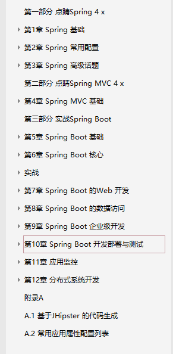
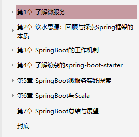

# springboot学习书籍
- 《Spring Boot实战 ,丁雪丰 (译者) .pdf》
- 《Spring Boot实战(JavaEE开发的颠覆者完整版.pdf》
- 《SpringBoot2精髓.pdf》
- 《SpringBoot揭秘快速构建微服务体系.pdf》
- 《深入实践Spring+Boot.陈韶健.pdf》

#### 《Spring Boot实战 ,丁雪丰 (译者) .pdf》

#### 《Spring Boot实战(JavaEE开发的颠覆者完整版.pdf》

#### 《SpringBoot2精髓.pdf》

  
#### 《SpringBoot揭秘快速构建微服务体系.pdf》

#### 《深入实践Spring+Boot.陈韶健.pdf》

