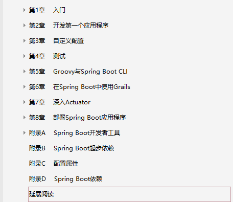
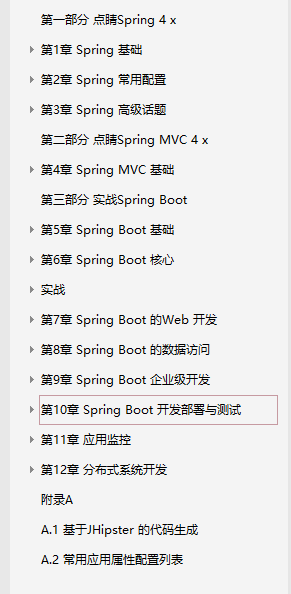

### springcloud学习书籍 
>>>>书籍本地路径：<G:\java学习资料\java学习书籍\springCloud学习文档>

#### 《Spring Cloud微服务实战_翟永超(著).pdf》

#### 《疯狂Spring Cloud微服务架构实战.pdf》

#### 《深入理解Spring Cloud与微服务构建.pdf》

#### 《重新定义Spring Cloud实战.pdf》  这本书相对比较新

### springboot学习书籍
>>>本地路径: <G:\java学习资料\java学习书籍\springCloud学习文档>

#### 《Spring Boot实战 ,丁雪丰 (译者) .pdf》

#### 《Spring Boot实战(JavaEE开发的颠覆者完整版.pdf》

#### 《SpringBoot2精髓.pdf》

  
#### 《SpringBoot揭秘快速构建微服务体系.pdf》

#### 《深入实践Spring+Boot.陈韶健.pdf》

### spring学习
>>>>本地路径: <G:\java学习资料\java学习书籍\spring>

#### 《Spring实战（第4版）.pdf》

