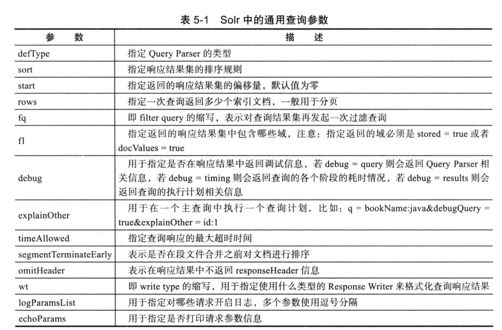

## solr搜索引擎学习整理， 下面是windows下部署solr
我参考的书籍是[《solr权威指南》](https://pan.baidu.com/s/15_cOk0ThWeQg622lxdOlmg)，上面有各种配置

### 下面是我windows测试的简单配置
1、[官网](https://lucene.apache.org/solr/downloads.html)下载solr的文件

2、修改web.xml,配置solr_home的路径

3、部署solr到tomcat或jeety等服务器 访问solr

4、在solr_home添加文件夹core(索引或叫表名称)，然后在core下面创建conf（配置文件夹），配置文件夹必须包含Schema.xml和solrconfig.xml

5、在Schema.xml中添加数据库字段，一般放到id字段下，
````
 <field name="created_date" type="date" indexed="true" stored="true" omitNorms="true"/>
    <field name="name" type="string" indexed="true" stored="true" omitNorms="true"/>
    <field name="email" type="string" indexed="true" stored="true" omitNorms="true"/>
    <field name="description" type="string" indexed="true" stored="true" omitNorms="true"/>
````

6、配置solrconfig.xml，引入solr-dataimporthandler-5.3.1.jar到
\webapps\solr\WEB-INF\lib下
````
    <requestHandler name="/dataimport" class="org.apache.solr.handler.dataimport.DataImportHandler">
        <lst name="defaults">
            <str name="config">data-config.xml</str>
        </lst>
    </requestHandler>
````

7、 配置data-config.xml文件,在solr_home/lib下添加mysql链接的jar，如下参考
````
<?xml version="1.0" encoding="UTF-8"?>
<dataConfig>
    <dataSource name="manager_log"
                type="JdbcDataSource"
                driver="com.mysql.jdbc.Driver"
                url="jdbc:mysql://localhost:3306/emm"
                user="root"
                password="123456"
    />
    <document>
        <entity name="manager_log"
                pk="id"
                dataSource="JdbcDataSource"
                query="select * from manager_log"
                deltaImportQuery="select * from manager_log where id = '${dih.delta.id}'"
                deltaQuery="select id from manager_log where created_date > '${dataimporter.last_index_time}'">
            <field column="created_date" name="created_date"/>
            <field column="name" name="name"/>
            <field column="email" name="email"/>
            <field column="description" name="description"/>
        </entity>
    </document>
</dataConfig>
````

## solr中的通用查询参数
具体位置: 在<solr权威指南>的第5章279页


## 注意：
1、引入数据有一个**clear**选项， 增量引入的时候去掉，不然会把以前全量引入的数据都覆盖了，以前的数据会消失掉了

2、数据量大的时候的处理：
* 在dataConfig.xml中配置batchSize="-1" 放到<datasource>标签里面