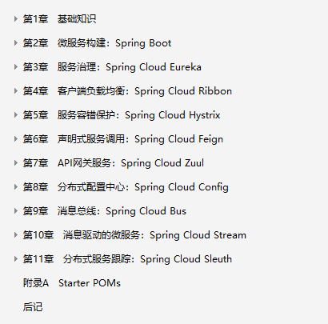
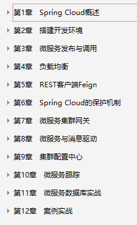
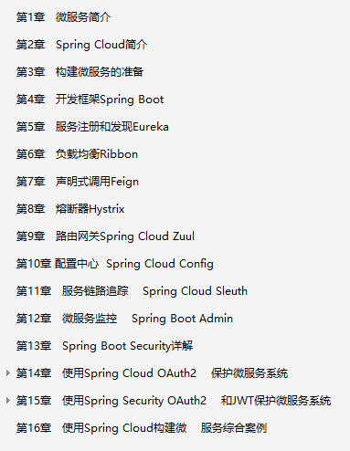
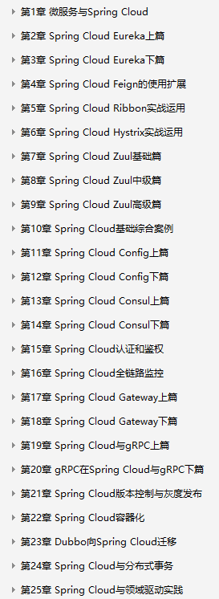
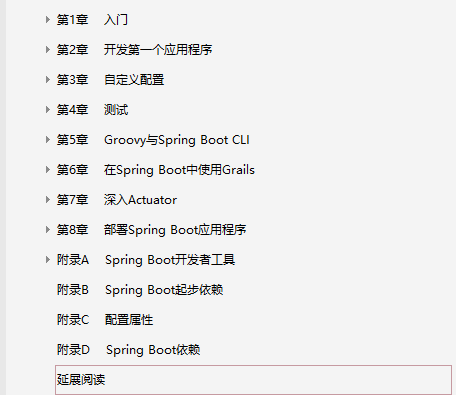
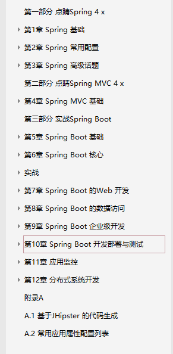
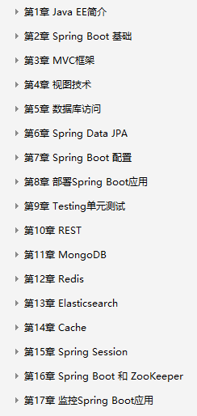
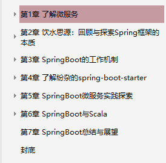
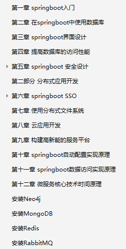
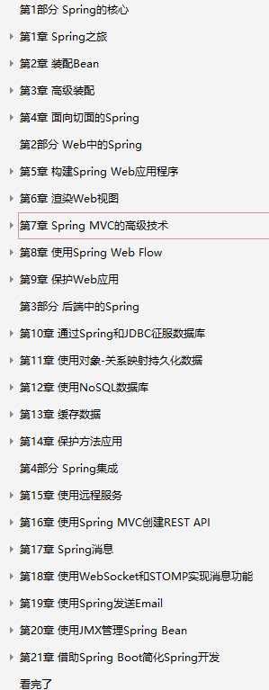

### springcloud学习书籍 对应我的书籍路径和源码：
#### [《Spring Cloud微服务实战_翟永超(著).pdf》](G:\java学习资料\java学习书籍\springCloud学习文档)

#### [《疯狂Spring Cloud微服务架构实战.pdf》]()

#### [《深入理解Spring Cloud与微服务构建.pdf》](G:\java学习资料\java学习书籍\springCloud学习文档)

#### [《重新定义Spring Cloud实战.pdf》](G:\java学习资料\java学习书籍\springCloud学习文档)

### springboot学习书籍
#### [Spring Boot实战 ,丁雪丰 (译者) .pdf]()

#### [Spring Boot实战(JavaEE开发的颠覆者 )  完整版.pdf]()

#### [SpringBoot2精髓.pdf]()

#### [SpringBoot揭秘快速构建微服务体系.pdf]()

#### [深入实践Spring+Boot.陈韶健.pdf]()

### spring学习

#### [Spring实战（第4版）.pdf](G:\java学习资料\java学习书籍\spring\Spring实战(第4版) \springshizhan)

